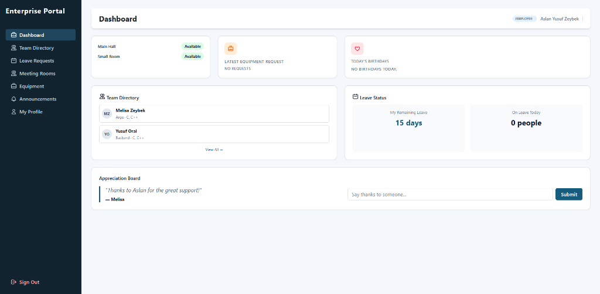
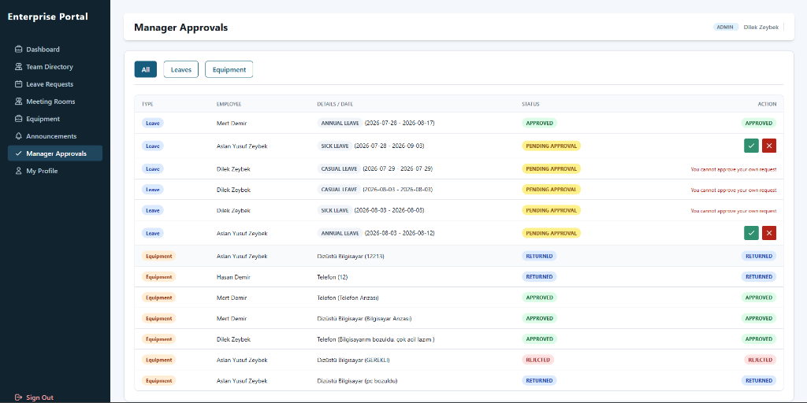
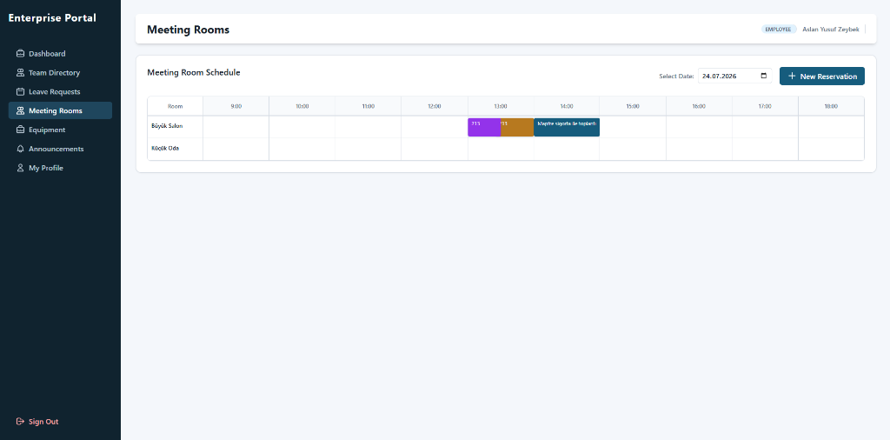
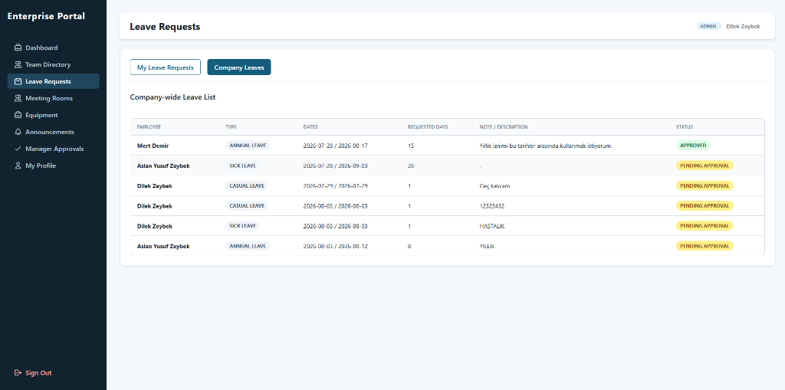
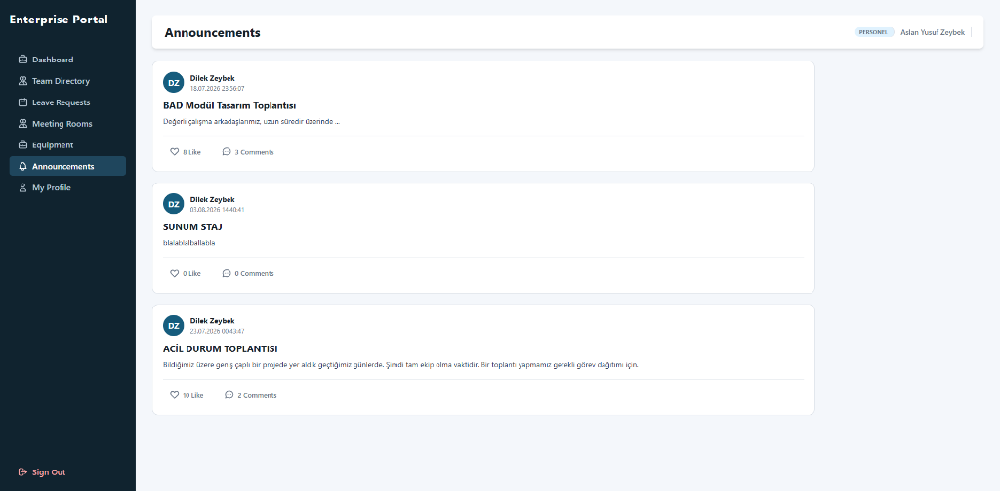

# Enterprise Portal

<div align="center">

[](#enterprise-portal)
[](./frontend/README.md)
[](#security--authentication-architecture)
[](#restful-api-design--implementation)
[](./LICENSE)

</div>

Enterprise Portal is a comprehensive, full-stack corporate operations and employee management system designed to centralize and streamline internal organizational workflows. The platform consolidates workforce directory management, meeting room reservations, leave processing, hardware inventory tracking, administrative approval workflows, and internal communications into a single unified interface.

The system is engineered on a layered three-tier architecture, pairing a robust **Spring Boot** RESTful API with a responsive **React (Vite)** single-page application and a **PostgreSQL** relational database.

---

## Application Showcase

### Executive Dashboard & Operations Hub

*Central overview providing real-time room occupancies, birthdays, personal leave balances, equipment request statuses, and an interactive team appreciation board.*

### Manager Approvals Portal (Admin & Manager Governance)

*Unified administrative queue for reviewing, approving, and rejecting leave and equipment requests with built-in self-approval prevention.*

### Visual Meeting Room Scheduler & Conflict Prevention

*Interactive timeline displaying real-time slot occupancy across rooms with client and server-side collision validation.*

### Company & Personal Leave Management

*Multi-tab interface providing personal submission tracking and company-wide leave schedules with automatic weekend exclusion.*

### Corporate Announcements & Team Collaboration

*Threaded communication feed for company updates, interactive comments, and post reactions.*

---

## Architecture Overview

The application follows a standard three-tier architecture with clean separation of concerns:

```
┌────────────────────────────────────────────────────────┐
│                   React (Vite) SPA                     │  ← Presentation Layer
│   State Management, Dynamic Routing, Adaptive RBAC UI  │
└───────────────────────────┬────────────────────────────┘
                            │ HTTP / REST (JSON + JWT)
┌───────────────────────────▼────────────────────────────┐
│              Spring Boot REST Controllers              │  ← API Layer
│   JWT Security Filters & Stateless Authorization       │
│   Service Layer (Business Rules & Conflict Checkers)   │
└───────────────────────────┬────────────────────────────┘
                            │ Spring Data JPA / Hibernate
┌───────────────────────────▼────────────────────────────┐
│                  PostgreSQL Database                   │  ← Persistence Layer
└────────────────────────────────────────────────────────┘
```

**Request Lifecycle:** Every client request is intercepted by a custom JWT authentication filter. Upon token validation and role verification, requests are routed to specific controllers that delegate business logic to the service layer. The service interacts with Spring Data JPA repositories, enforcing domain constraints before data is persisted or mapped to response DTOs.

---

## Security & Authentication Architecture

The system implements a stateless, token-based authentication and authorization mechanism powered by **Spring Security** and **JSON Web Tokens (JWT)**:

```
┌─────────────────┐                                        ┌────────────────────────┐
│                 │  1. POST /api/v1/auth/login (Creds)    │                        │
│                 ├───────────────────────────────────────►│  AuthController        │
│                 │                                        │  DaoAuthentication     │
│                 │  2. Return JWT (HMAC-SHA256 Token)     │  Provider (BCrypt)     │
│                 │◄───────────────────────────────────────┤                        │
│   React (Vite)  │                                        └────────────────────────┘
│    Client App   │                                        ┌────────────────────────┐
│                 │  3. API Request + "Bearer <JWT>"       │ JwtAuthenticationFilter│
│                 ├───────────────────────────────────────►│ (OncePerRequestFilter) │
│                 │                                        └───────────┬────────────┘
│                 │                                                    │ Validate Signature & Expiry
│                 │                                                    ▼
│                 │                                        ┌────────────────────────┐
│                 │                                        │ SecurityContextHolder  │
│                 │                                        │ (UserDetails + Roles)  │
│                 │                                        └───────────┬────────────┘
│                 │                                                    │ Dispatch
│                 │                                                    ▼
│                 │  4. Response Payload (DTO / 200 OK)    ┌────────────────────────┐
│                 │◄───────────────────────────────────────┤ REST Controllers       │
└─────────────────┘                                        └────────────────────────┘
```

### Authentication & Token Lifecycle
1. **Stateless Session Management:** The backend operates under `SessionCreationPolicy.STATELESS`. No server-side HTTP sessions or session cookies are maintained, eliminating CSRF vulnerabilities and enabling horizontal scalability.
2. **JWT Issuance & Cryptographic Signing:** Upon valid authentication via `DaoAuthenticationProvider`, `JwtService` generates a compact JWT signed with the `HMAC-SHA256` algorithm using a Base64-encoded secret key. The token carries the user's principal (email), issued timestamp, and an expiration timestamp.
3. **Filter Interception (`OncePerRequestFilter`):** On every incoming HTTP request, `JwtAuthenticationFilter` intercepts the exchange:
   - Inspects the `Authorization` header and extracts the `Bearer ` token.
   - Decodes and verifies the signature and validates token expiration.
   - Loads user details through `UserDetailsService` and maps user roles to Spring Security `SimpleGrantedAuthority` (`ROLE_EMPLOYEE`, `ROLE_MANAGER`, `ROLE_ADMIN`).
   - Populates Spring's `SecurityContextHolder` with an authenticated `UsernamePasswordAuthenticationToken`.
4. **Password Hashing:** All personnel passwords are encrypted using `BCryptPasswordEncoder` (salted one-way hashing) prior to persistence.
5. **Unauthorized Request Handling:** Unauthenticated attempts to access secured endpoints are captured by `AuthEntryPoint` (implementing `AuthenticationEntryPoint`), returning a standard HTTP `401 Unauthorized` response.

---

## Role-Based Access Control (RBAC) & Governance

The platform features an adaptive Role-Based Access Control model enforced both at the UI layer and at API endpoint boundaries:

| Capability | Employee | Manager | Admin |
|------------|:--------:|:-------:|:-----:|
| Personal Dashboard & Profile Management | Yes | Yes | Yes |
| Team Directory Search & Filtering | Yes | Yes | Yes |
| Meeting Room Reservation (Book/Update/Cancel own) | Yes | Yes | Yes |
| Submit Leave & Equipment Requests | Yes | Yes | Yes |
| Post Announcements & Comments | Comments only | Comments only | Yes |
| Access **Manager Approvals** Hub | No | **Yes** | **Yes** |
| Approve / Reject Leave Requests | No | **Yes** | **Yes** |
| Approve / Reject Hardware Requests | No | **Yes** | **Yes** |
| View Company-Wide Leave Rosters | No | **Yes** | **Yes** |
| View Company-Wide Hardware Inventory | No | **Yes** | **Yes** |

### Key Governance & Validation Rules
- **Backend & Service-Level Enforcement:** Core business rules are strictly defended at the service boundary. Even if a client bypasses UI guards, the service layer rejects unauthorized actions.
- **Dynamic Navigation & Route Protection:** Authenticated user roles (`ADMIN`, `MANAGER`, `EMPLOYEE`) control UI rendering in React. Administrative tabs (such as **Manager Approvals**) and actionable controls (approve/reject buttons, announcement creation forms) are dynamically mounted or hidden.
- **Self-Approval Prevention:** Managers and administrators are strictly prohibited from approving their own leave or equipment requests (`You cannot approve your own request`). These requests are flagged and must be approved by another designated manager or administrator.
- **Dual-Layer Meeting Conflict Checking:** Room reservations undergo continuous client-side validation (`useMemo`) to disable submission during overlapping time frames, accompanied by strict server-side overlap checks before database persistence.
- **Working Day Leave Calculator:** Leave requests automatically calculate billable working days by filtering out weekend days (Saturday and Sunday) in real time.
- **Cascading Integrity:** Deleting corporate announcements triggers database cascades (`orphanRemoval = true`), safely eliminating orphan discussion comments without manual intervention.

---

## RESTful API Architecture & Design Principles

The backend is engineered around a modern, scalable, and fully decoupled RESTful API architecture:

### 1. Resource-Oriented URI Conventions & HTTP Semantics
All API routes are organized under the unified `/api/v1/` prefix with clean, noun-based resource paths:
- **`GET`**: Safe, idempotent retrieval of resources or collections (e.g., `/api/v1/personel/get/all`, `/api/v1/meeting-rooms/get/{id}`).
- **`POST`**: Creation of new entities, returning HTTP `201 Created` with the newly persisted representation.
- **`PUT`**: Updates and state transitions, returning HTTP `200 OK`.
- **`DELETE`**: Safe resource removals, returning HTTP `204 No Content` with an empty response body.

### 2. Strict DTO (Data Transfer Object) Encapsulation
Database entities (`@Entity`) are never exposed directly over the wire. Instead, dedicated DTO contracts maintain architectural isolation:
- **Request DTOs** (e.g., `DtoLeaveRequestCreate`, `DtoPersonelRequest`, `DtoRoomReservationCreate`): Encapsulate incoming payloads, enforcing required types and validation rules.
- **Response DTOs** (e.g., `DtoLeaveRequestResponse`, `DtoPersonelResponse`, `DtoMeetingRoom`): Project sanitized domain data to the client, preventing accidental leakage of sensitive attributes (such as password hashes, audit fields, or internal relationship graphs).

### 3. Declarative Validation & Centralized Error Handling
- **JSR-380 Bean Validation:** Controller endpoints enforce input constraints using `@Valid` on request bodies (`@NotNull`, `@NotBlank`, `@Email`, `@Size`).
- **Global Exception Handler (`@ControllerAdvice`):** `GlobalExceptionHandler` intercepts application exceptions and maps them into a uniform, standardized `ErrorDetails` JSON structure:
  ```json
  {
    "timestamp": "2026-09-04T19:30:00",
    "message": "startDate: must not be null, endDate: must not be null",
    "details": "uri=/api/v1/leave-request",
    "errorCode": "VALIDATION_ERROR_400"
  }
  ```
- **Semantic HTTP Error Mapping:**
  - `ResourceNotFoundException` → `404 Not Found` (`NOT_FOUND_404`)
  - `BadRequestException` & `MethodArgumentNotValidException` → `400 Bad Request` (`BAD_REQUEST_400` / `VALIDATION_ERROR_400`)
  - `BadCredentialsException` → `401 Unauthorized` (`UNAUTHORIZED_401`)
  - Unhandled exceptions → `500 Internal Server Error` (`INTERNAL_SERVER_ERROR_500`)

### 4. Client-Side API Consumer Pattern (React)
The frontend communicates with the backend via a centralized, robust `request(path, options)` utility:
- **Automatic Bearer Token Injection:** Attaches `Authorization: Bearer <token>` to the HTTP headers of every outgoing call when an authenticated session exists.
- **Automated Session Invalidation:** When receiving HTTP `401` or `403` status codes (indicating expired or invalid tokens), the client instantly purges `localStorage` and resets authentication state, redirecting the user to the login screen.
- **Unified JSON & No-Content Handling:** Handles HTTP `204 No Content` responses seamlessly while automatically parsing JSON response payloads and surfacing backend validation error messages in toast notifications.

---

## REST API Endpoints Specification

Below is an overview of the primary RESTful endpoints exposed by the backend service:

| Resource Area | Method | Endpoint | Description | Access Level |
|---|:---:|---|---|:---:|
| **Authentication** | `POST` | `/api/v1/auth/login` | Authenticate user & issue JWT bearer token | Public |
| | `POST` | `/api/v1/auth/register` | Register new employee profile | Public |
| **Personnel** | `GET` | `/api/v1/personel/get/all` | Retrieve complete employee list | Authenticated |
| | `GET` | `/api/v1/personel/get/{id}` | Retrieve individual employee profile | Authenticated |
| | `GET` | `/api/v1/personel/get/active-personel` | Retrieve active employee directory | Authenticated |
| | `POST` | `/api/v1/personel` | Create a new employee record | Authenticated |
| | `PUT` | `/api/v1/personel/update/{id}` | Update employee personal/contact details | Authenticated |
| | `PUT` | `/api/v1/personel/change-password/{id}` | Update password with old password verification | Authenticated |
| | `DELETE` | `/api/v1/personel/delete/{id}` | Remove employee record (HTTP 204) | Authenticated |
| **Leave Management** | `POST` | `/api/v1/leave-request` | Submit new leave request (Annual, Casual, Sick) | Authenticated |
| | `GET` | `/api/v1/leave-request/get/all` | Fetch all company leave submissions | Manager / Admin |
| | `GET` | `/api/v1/leave-request/get/personel/{id}` | Fetch leave history for specific employee | Authenticated |
| | `GET` | `/api/v1/leave-request/get/status/{status}` | Filter leave requests by status | Manager / Admin |
| | `PUT` | `/api/v1/leave-request/update/status/{id}` | Approve or reject leave request with note | Manager / Admin |
| | `DELETE` | `/api/v1/leave-request/delete/{id}` | Delete a leave request | Authenticated |
| **Meeting Rooms** | `GET` | `/api/v1/meeting-rooms/get/all` | List all meeting rooms and capacities | Authenticated |
| | `POST` | `/api/v1/meeting-rooms` | Create a new meeting room | Admin |
| | `PUT` | `/api/v1/meeting-rooms/updated/{id}` | Update room details | Admin |
| | `DELETE` | `/api/v1/meeting-rooms/delete/{id}` | Delete a meeting room | Admin |
| **Room Reservations**| `GET` | `/api/v1/room-reservation/get/all` | Retrieve all scheduled reservations | Authenticated |
| | `GET` | `/api/v1/room-reservation/get/room/{roomId}`| Retrieve reservations for a specific room | Authenticated |
| | `POST` | `/api/v1/room-reservation` | Reserve room slot (with collision checks) | Authenticated |
| | `DELETE` | `/api/v1/room-reservation/delete/{id}` | Cancel/delete existing reservation | Authenticated |
| **Equipment & Assets**| `GET` | `/api/v1/equipment/get/all` | List company hardware inventory | Authenticated |
| | `GET` | `/api/v1/equipment-assignment/get/all` | List hardware assignments & requests | Manager / Admin |
| | `POST` | `/api/v1/equipment-assignment` | Request or assign hardware device | Authenticated |
| | `PUT` | `/api/v1/equipment-assignment/update/status/{id}`| Approve, reject, or return equipment | Manager / Admin |
| **Announcements** | `GET` | `/api/v1/announcements/get/all` | Fetch feed of corporate announcements | Authenticated |
| | `POST` | `/api/v1/announcements` | Publish company announcement | Admin |
| | `DELETE` | `/api/v1/announcements/delete/{id}` | Remove announcement & cascade comments | Admin |
| **Comments** | `GET` | `/api/v1/comments/get/announcement/{id}`| Fetch threaded comments for announcement | Authenticated |
| | `POST` | `/api/v1/comments` | Post comment on an announcement | Authenticated |
| | `DELETE` | `/api/v1/comments/delete/{id}` | Delete comment | Authenticated |

---

## Core Modules

### 1. Dynamic Team Directory (Hierarchical Tree View)
Presents organizational departments as collapsible hierarchical trees. Department managers are highlighted with distinct accent styling at the top of each branch, followed by team personnel. Supports instant client-side filtering across names, departments, roles, and technical skills.

### 2. Meeting Room Scheduler
Provides visual timeline grids indicating room availability hour-by-hour (09:00 - 18:00). Users can select vacant time slots to pre-fill booking modals, inspect meeting objectives, and modify or cancel existing reservations they own.

### 3. Leave Management & Approval Engine
Enables staff to request Annual, Casual, or Sick leave. Requests route directly to the manager approval queue. Standard employees view personal request histories, while managers access comprehensive organizational leave schedules.

### 4. Equipment Provisioning & Hardware Lifecycle
Tracks company hardware through distinct lifecycle states (`IN STORAGE`, `ASSIGNED`, `RETURNED`, `FAULTY`). Employees can request devices with justifications, and return assigned equipment directly from their profile.

### 5. Corporate Announcements & Appreciation Board
Facilitates organization-wide updates with threaded comments and likes. Features an interactive appreciation widget on the dashboard allowing team members to publicly recognize peers.

### 6. Profile & Security Center
Allows personnel to manage personal data (email, date of birth, technical skill tags, and profile photo uploads with database TEXT-encoding support) alongside self-service password updates with current password verification.

---

## Tech Stack

| Layer | Technology | Description |
|-------|-----------|-------------|
| Backend Framework | Spring Boot 3.x | REST API, Dependency Injection, Security Configuration |
| Security | Spring Security & JWT | Stateless token-based authentication and authorization |
| Persistence | Spring Data JPA / Hibernate | Object-Relational Mapping (ORM) and schema auto-generation |
| Database | PostgreSQL 15 | Relational database storage |
| API Documentation | Swagger / OpenAPI | Interactive API specification at `/swagger-ui.html` |
| Frontend Framework | React 19 | Component architecture with hooks-based state management |
| Build Tool (Frontend) | Vite | Fast HMR dev server and optimized production bundling |
| Build Tool (Backend) | Maven | Dependency management and build lifecycle |
| Boilerplate Reducer | Lombok | Automatic generation of getters, setters, and constructors |

---

## Prerequisites

Ensure the following tools are installed before running the project:

- **Java 17** or higher (JDK)
- **Node.js 18** or higher (with npm)
- **Docker** & **Docker Compose** *(Recommended for instant database setup)*

---

## Getting Started

### Step 1 — Launch the Database (Docker)

The project includes a ready-to-use `docker-compose.yml` file configuring PostgreSQL:

```bash
docker-compose up -d
```

*Default credentials:* Port `5432`, Username `postgres`, Password `123`, Database `postgres`.

### Step 2 — Start the Backend (Spring Boot)

From the project root directory:

```bash
# Windows
mvnw.cmd spring-boot:run

# macOS / Linux
./mvnw spring-boot:run
```

The server initializes on `http://localhost:8080`. Hibernate will automatically generate all database schemas on startup. Access Swagger documentation at `http://localhost:8080/swagger-ui.html`.

### Step 3 — Start the Frontend (React / Vite)

Open a separate terminal window:

```bash
cd frontend
npm install
npm run dev
```

The application will be accessible at `http://localhost:5173`.

---

## Project Directory Structure

```
enterprise-portal/
├── src/main/java/com/aslan/
│   ├── config/          # Security filters, CORS, and password encoders
│   ├── controller/      # REST API endpoints
│   ├── dto/             # Data Transfer Objects
│   ├── entity/          # JPA database entities
│   ├── enums/           # System enumerations 
│   ├── exception/       # Custom business exceptions
│   ├── handler/         # Global REST exception handler
│   ├── jwt/             # JWT token provider, filter, and authentication DTOs
│   ├── repository/      # Spring Data JPA repositories
│   └── service/         # Business logic implementation
├── frontend/            # React 19 + Vite SPA (See frontend/README.md)
│   ├── src/
│   │   ├── App.jsx      # Core single-page application & module views
│   │   ├── index.css    # Custom responsive design system
│   │   └── main.jsx     # Frontend entry point
│   └── README.md        # Dedicated frontend documentation
├── docs/
│   └── screenshots/     # Application screenshots for documentation
├── docker-compose.yml   # PostgreSQL container specification
├── LICENSE              # MIT License specification
├── pom.xml              # Maven dependencies & plugins
└── README.md
```

---

## API Documentation

When the backend application is running, the full interactive OpenAPI specification is accessible via Swagger UI:

```
http://localhost:8080/swagger-ui.html
```

---

## Contributing

1. Fork this repository.
2. Create a feature branch: `git checkout -b feature/NewFeature`
3. Commit your changes: `git commit -m 'Add NewFeature'`
4. Push to branch: `git push origin feature/NewFeature`
5. Submit a Pull Request.


---

## License

This project is licensed under the MIT License - see the [LICENSE](./LICENSE) file for details.
